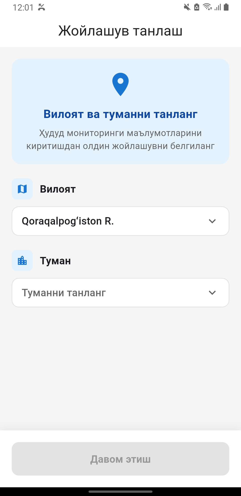
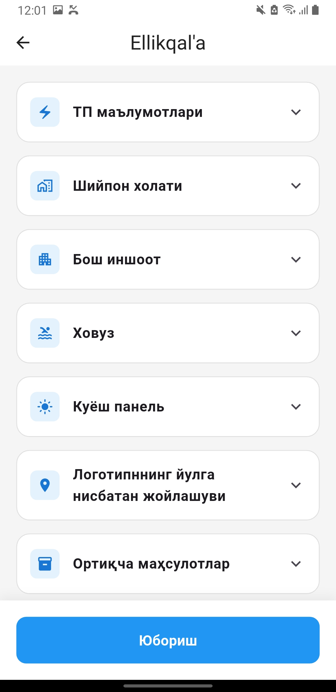
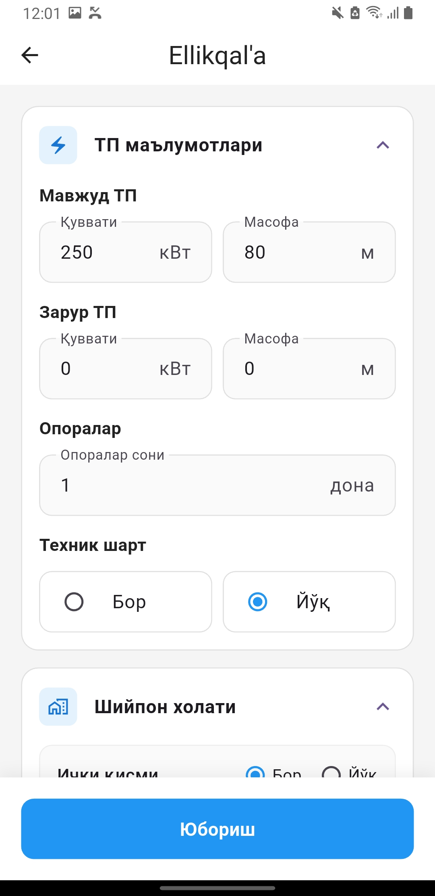
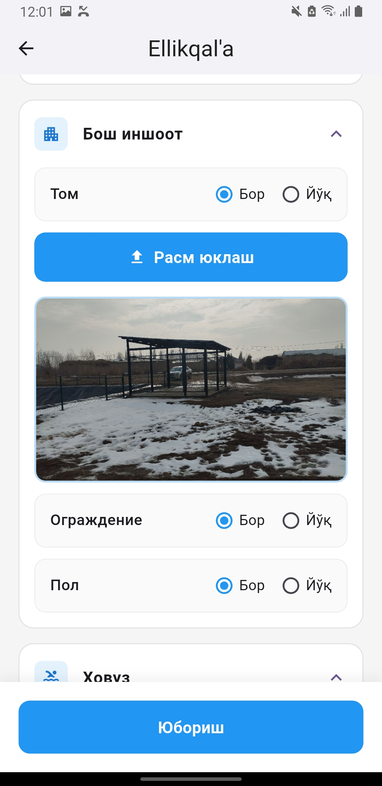
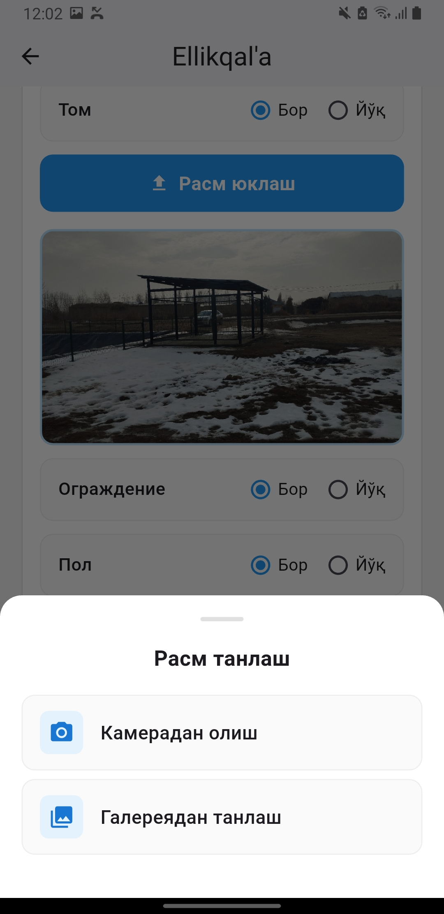
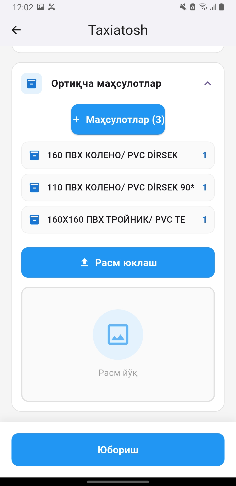
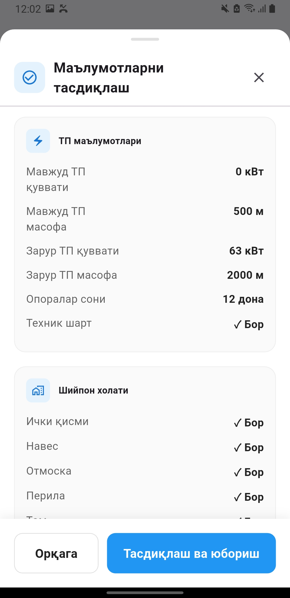
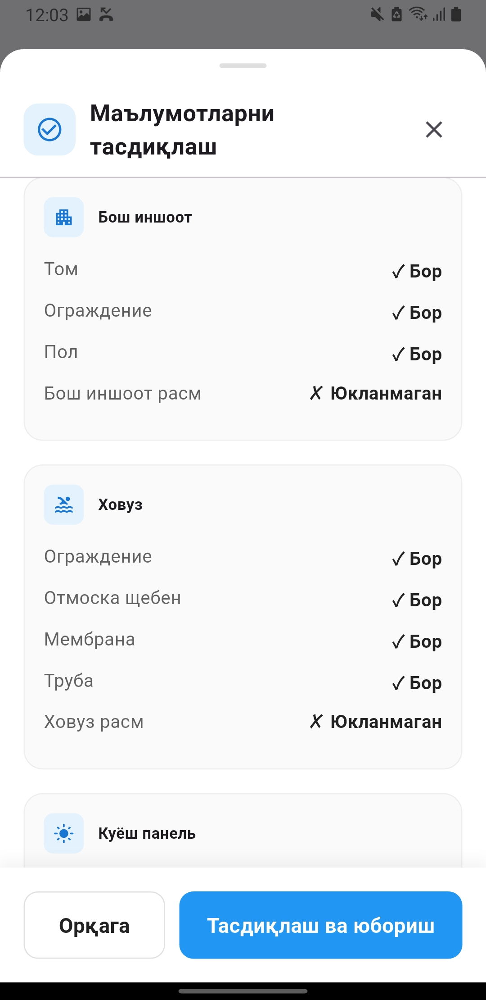
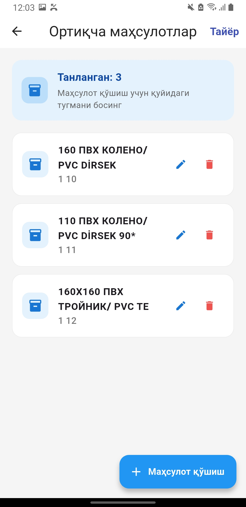
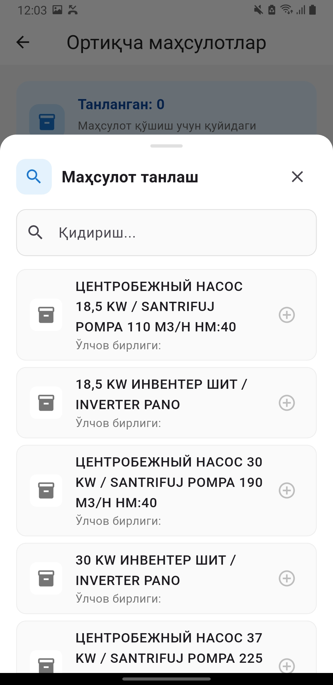

# Waterserver Report App

The Waterserver Report app is developed using Flutter and Dart, designed to collect and manage reports about work carried out across different regions.

# 📌 Features:

Report Management: Add and update reports related to regional activities.

Data Organization: Structured storage of reports for easy access and tracking.

User-Friendly Interface: Simple and clean UI for smooth usage.

State Management with Bloc: Ensures responsive and maintainable app behavior.

# 🛠 Technologies:

Flutter & Dart: Core technologies for app development.

Bloc: For efficient state management.

Dio: Used for API requests and data handling

#

  
  
  
  
  
  
  
  
  
  

Author: [Hasanov Jahongir]

Contact: [jahonh959@gmail.com]
